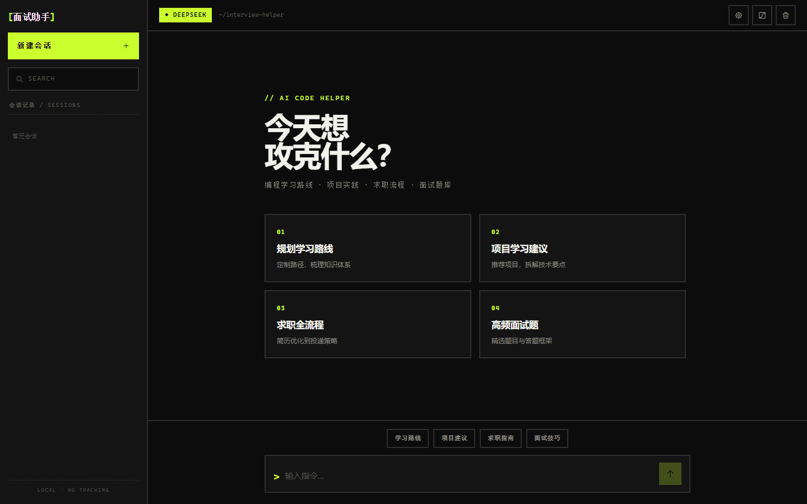
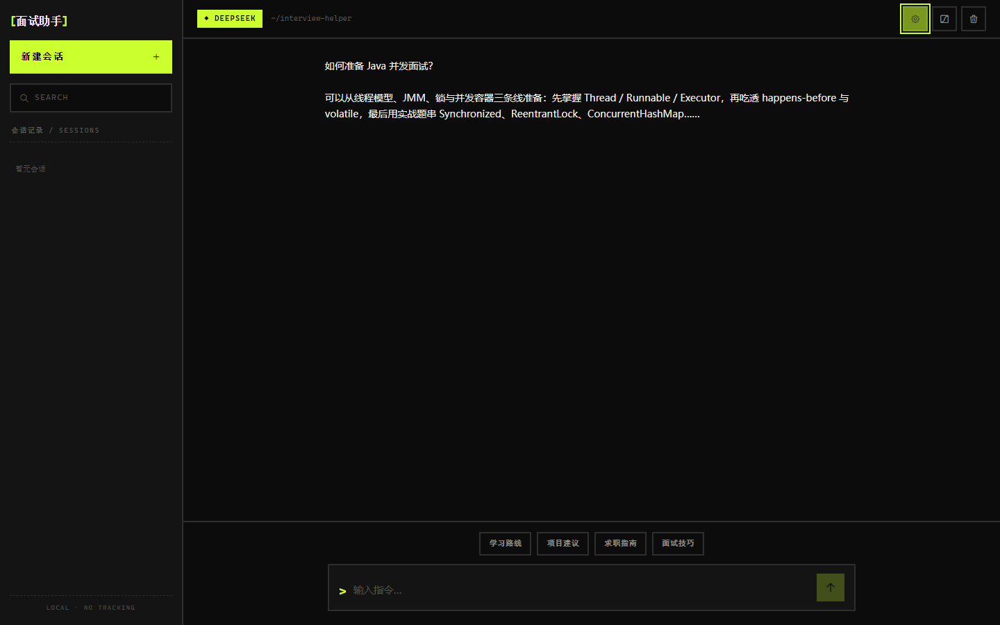
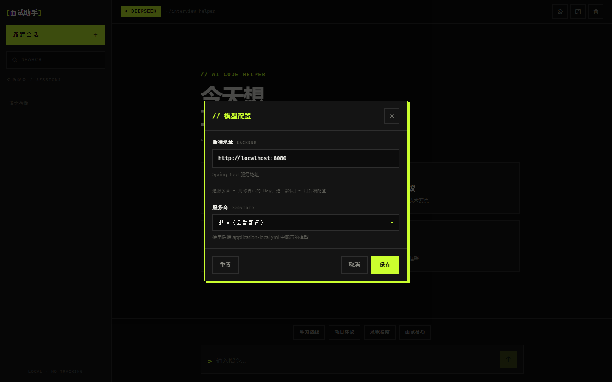

# AI Code Helper · AI 编程面试助手

Spring Boot 3.5 + LangChain4j 的面试学习助手：**DeepSeek** 流式对话 + RAG + Tool Calling + MCP，外加 Vite 原生 JS 前端壳（支持 BYOK）。

> 定位：学习 LangChain4j 大模型应用工程的完整示例——覆盖编程学习路线、项目建议、求职全流程与高频面试题。

<p align="center">
  
</p>

<p align="center">
  <a href="#功能特性">功能</a> ·
  <a href="#showcase">Showcase</a> ·
  <a href="#快速开始">快速开始</a> ·
  <a href="#架构与能力链路">架构</a> ·
  <a href="#目录结构">目录</a> ·
  <a href="#相关文档">文档</a>
</p>

---

## 为什么做这个

把「对话 + 记忆 + RAG + 工具 + 护轨 + SSE」串成一条可跑通的主链路，并配上可联调的前端壳，方便对照源码理解 LangChain4j 工程化写法——不是又一个空壳 Chat Demo。

---

## 功能特性


| 能力 | 说明 | 关键实现 |
|------|------|----------|
| 智能对话 | 编程学习 / 求职面试领域问答 | `AiCodeHelperService` + `system-prompt.txt` |
| 流式输出（SSE） | Reactor `Flux` 逐块推送 | `AiController#chat` |
| 默认 DeepSeek | OpenAI 兼容同步/流式 ChatModel | `DeepSeekChatModelConfig` |
| BYOK | 请求头覆盖 apiKey / baseUrl / model | `DynamicAiServiceFactory` |
| RAG | 本地知识库切段向量检索增强 | `RagConfig` |
| MCP | 智谱 BigModel Web Search | `McpConfig` |
| Tool Calling | Jsoup 爬公开面试题链接 | `InterviewQuestionTool` |
| 会话记忆 | `memoryId` 隔离，最近 10 条 | 工厂装配 |
| 输入护轨 | 敏感词命中即拦截 | `SafeInputGuardrail` |
| 前端壳 | 会话列表 · SSE · 主题 · 模型设置 | `frontend/` |

---

## Showcase

本仓是**单产品应用**：不单独建 Preview Gallery（无组件库/多 demo 墙）。产品主链路用 Showcase 举证。

### 推荐演示路径

1. 配置 `application-local.yml`（DeepSeek + DashScope Embedding + 智谱 Key）  
2. 仓库根：`mvnw.cmd spring-boot:run`（后端 `:8080`）  
3. `cd frontend && npm install && npm run dev`（前端 `:5173`）  
4. 打开对话壳 → 点快捷提问或输入「如何准备 Java 并发面试」→ 观察 SSE 逐字输出  
5. （可选）设置弹窗填入自有 Key，验证 BYOK Headers  

| 步骤 | 界面 | 截图 |
|------|------|------|
| 1 | 空会话 / 欢迎与快捷提问 |  |
| 2 | 对话区（示例气泡） |  |
| 3 | 模型设置（BYOK） |  |

> Showcase 为 Vite 实机截图（Playwright）。`showcase-chat` 在无后端时注入了示例气泡以展示对话态；接上 SSE 后可用真流式截图替换。历史 contact sheet：`preview-contact-sheet.png`（**不是** Preview 站壳）。

---

## Preview

**本仓省略独立 Preview 站**（单产品、无目录式资产 Gallery）。  
若只需预览 README 排版，使用根目录 README 本地预览壳：

```bash
# 仓库根
python -m http.server 8092
# 浏览器打开
http://127.0.0.1:8092/preview-readme.html
```

必须经 HTTP 打开；`file://` 无法 `fetch` README。

---

## 技术栈


| 层 | 选型 |
|----|------|
| 运行时 | JDK 21 |
| 后端 | Spring Boot 3.5.13 Web · Maven Wrapper |
| AI | LangChain4j 1.1.0 / beta7（reactor · mcp · dashscope · open-ai） |
| 对话 | DeepSeek（默认 `deepseek-v4-flash`） |
| 向量 | DashScope Qwen Embedding |
| 工具 | Jsoup · 智谱 MCP web_search |
| 前端 | Vite ^6.3.5 · 原生 JS（无 React/Vue） |

---

## 架构与能力链路


```
浏览器 Vite:5173
  │  GET /ai/chat?memoryId&message
  │  Headers: X-Model-*（可选 BYOK）
  ▼
AiController
  ├─ 默认 → AiCodeHelperServiceFactor（DeepSeek + Memory + RAG + Tool + MCP）
  └─ 覆盖 → DynamicAiServiceFactory 缓存
        │
        ├─ SafeInputGuardrail
        ├─ MessageWindowChatMemory（10）
        ├─ ContentRetriever（Qwen Embedding / 内存库）
        ├─ InterviewQuestionTool
        └─ McpToolProvider（BigModel web_search）
              ▼
        StreamingChatModel → SSE chunks
```


生产 API：

```
GET /ai/chat?memoryId={会话ID}&message={用户消息}
```

返回 `text/event-stream`。示例：

```bash
curl -N "http://localhost:8080/ai/chat?memoryId=1&message=如何准备Java并发面试"
```

---

## 目录结构


```text
simple-ai-code-helper/
├── AGENTS.md / CLAUDE.md / CONTEXT.md / LANGUAGES.md
├── README.md
├── preview-readme.{html,css,js}     # README 本地预览壳（端口 8092）
├── pom.xml · mvnw*
├── frontend/                        # Vite 对话壳
│   ├── index.html · app.js · styles.css
│   └── vite.config.js               # :5173
├── src/main/java/.../aicodehelper/
│   ├── AiCodeHelperApplication.java
│   └── ai/
│       ├── controller/AiController.java
│       ├── AiCodeHelperService.java · AiCodeHelperServiceFactor.java
│       ├── DynamicAiServiceFactory.java
│       ├── model/DeepSeekChatModelConfig.java · QwenChatModelConfig.java
│       ├── rag/ · mcp/ · tools/ · guardrail/ · listener/ · config/
├── src/main/resources/
│   ├── application.yml · application-local.yml.example
│   ├── system-prompt.txt
│   └── docs/                        # RAG 知识库（3 份 MD）
├── assets/images/readme/            # README 配图 + Showcase
├── docs/
│   ├── agents/ · adr/ · glossary/ · knowledge/
│   └── outputs/{report,prd,handoff,commit-history}/
└── canvases/                        # Cursor Canvas 分析（可选）
```

### Key docs

| 文档 | 用途 |
|------|------|
| [`CONTEXT.md`](./CONTEXT.md) | 领域术语与技术事实 |
| [`LANGUAGES.md`](./LANGUAGES.md) | 共享任务流用词 |
| [`AGENTS.md`](./AGENTS.md) | Agent 硬约束与门禁 |
| [`docs/agents/workflow.md`](./docs/agents/workflow.md) | Issue → PRD → handoff |
| [`docs/adr/`](./docs/adr/) | 架构决策（含 ADR-0000） |
| [`docs/outputs/prd/readme-diagrams/`](./docs/outputs/prd/readme-diagrams/) | README 配图 brief / prompts |

---

## 快速开始

### 前置

- JDK 21+  
- Node.js 18+（前端）  
- API Key：DeepSeek（对话）· 阿里云百炼 DashScope（Embedding）· 智谱 BigModel（MCP，可选但缺省会导致占位符解析失败）

### 1. 配置密钥

```bash
cp src/main/resources/application-local.yml.example src/main/resources/application-local.yml
```

编辑 `application-local.yml`，填入真实 `deepseek.api-key`、`langchain4j.community.dashscope...api-key`、`bigmodel.api-key`。  
该文件已被 `.gitignore` 忽略，勿提交。

### 2. 启动后端

```bash
# 必须从仓库根启动（RagConfig 相对路径加载知识库）
./mvnw spring-boot:run        # Linux/macOS
mvnw.cmd spring-boot:run      # Windows
```

### 3. 启动前端

```bash
cd frontend
npm install
npm run dev
```

浏览器打开 Vite 提示的地址（默认 `http://127.0.0.1:5173`）。

---

## RAG 知识库

- 位置：`src/main/resources/docs/`（Java 基础面试题 · AI 大模型面试题 · 简历指南）  
- 切段：`DocumentByParagraphSplitter(1000, 200)` → Embedding → 内存库  
- 检索：Top 5，`minScore ≥ 0.75`  
- 新增：放入同目录 Markdown，重启生效  

---

## 已知限制

- 内存向量库：每次启动重建，不持久化  
- 知识库相对路径：打可执行 jar 后当前加载方式不可用（已知待改进）  
- 前端消息正文不落盘：刷新后侧栏有会话名，内容需重聊  
- `AiCodeHelper`（演示类）与 `AiCodeHelperService`（Controller 主路径）并存，讨论时需指明  

---

## 测试

```bash
./mvnw test
```

---

## 路线图（文档层）

- [ ] 补齐 Showcase 真机三连截图  
- [ ] （可选）知识库改为 classpath / 可配置路径，支持 jar 运行  
- [ ] （可选）会话消息持久化策略  

业务功能须走 `Issue → PRD → handoff`，PRD 未批准不写功能代码。

---

## 相关文档

- 领域术语：[`CONTEXT.md`](./CONTEXT.md)  
- 共享用词：[`LANGUAGES.md`](./LANGUAGES.md)  
- Agent 约定：[`AGENTS.md`](./AGENTS.md) · [`docs/agents/`](./docs/agents/)  
- 调研报告：[`docs/outputs/report/project-init/`](./docs/outputs/report/project-init/)  
- 视觉方向：[`docs/outputs/prd/readme-diagrams/VISUAL-DIRECTION.md`](./docs/outputs/prd/readme-diagrams/VISUAL-DIRECTION.md)  
